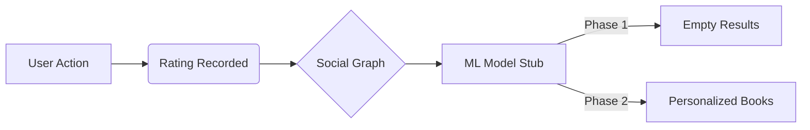

# OmniReads — System Architecture & Technical Specification

## 1. Executive Summary
OmniReads is a next-generation social book discovery platform. It leverages a hybrid cloud architecture combining the speed of **Next.js**, the robustness of **Django**, and the scalability of **Supabase**. The system is architected for "Inference-Ready" deployment, allowing for a seamless transition from a basic social graph to an AI-driven recommendation engine.

---

## 2. Technology Stack & Rationale

| Layer | Technology | Rationale |
| :--- | :--- | :--- |
| **Frontend** | **Next.js 14+** | Server-Side Rendering (SSR) for SEO-friendly book pages and fast initial load. |
| **Backend** | **Django REST Framework** | Powerful ORM for complex social relations and a native environment for Python ML models. |
| **Auth / DB** | **Supabase (Postgres)** | Real-time database capabilities with built-in Row Level Security (RLS) and JWT auth. |
| **Styling** | **Vanilla CSS / Tailwind** | High-performance, responsive design with a premium, custom aesthetic. |

---

## 3. Core Architecture Components

### 3.1 Frontend Orchestration (Next.js)
The frontend serves as the gateway for users. It utilizes **Supabase SSR** for session management and a custom **API middleware** to proxy requests to the Django backend.
- **Client Side**: Handles real-time UI updates (ratings, friend requests).
- **Server Side**: Fetches initial book metadata and SEO tags.

### 3.2 Logic & AI Layer (Django)
Django acts as the "Brain" of the operation. It performs:
1.  **JWT Validation**: Decodes Supabase-issued tokens to verify user identity.
2.  **Social Business Logic**: Manages complex "Friendship" states and recommendation routing.
3.  **ML Integration (Phase 2)**: Loads a Scikit-Learn `.pkl` model into memory at startup to serve real-time predictions via `api/recommender.py`.

### 3.3 Infrastructure & Security (Supabase)
Supabase provides the foundation:
- **PostgreSQL**: Stores all relational data.
- **RLS (Row Level Security)**: Ensures that users can only modify their own ratings and view their own private recommendations, even if the API layer is bypassed.

---

## 4. API Design & Data Flow

### 4.1 Authentication Sequence
1.  User authenticates with Supabase (Magic Link/OAuth).
2.  Supabase returns a **JWT**.
3.  Frontend stores the session and attaches the JWT to the `Authorization: Bearer <token>` header for all Django requests.
4.  Django verifies the token using the shared `SUPABASE_JWT_SECRET`.

### 4.2 Recommender Lifecycle

---

## 5. Database Schema (High-Level)

The relational schema is designed for rapid traversal of user-book edges:

- **`profiles`**: User metadata (ID shared with Auth).
- **`books`**: Central repository for book metadata.
- **`ratings`**: Many-to-Many join table with a `score` attribute (1-5).
- **`friendships`**: Self-referential join table for the social graph.
- **`recommendations`**: Transactional table for direct user-to-user suggestions.

---

## 6. Phase 2: AI Implementation Path
The system is built to ingest two primary signals for Phase 2:
1.  **Direct Signal**: User's own rating history.
2.  **Social Signal**: Friends' rating history (Collaborative Filtering).

The `api/recommender.py` module is the single point of injection for the ML model, ensuring the rest of the stack remains decoupled from the AI implementation details.
